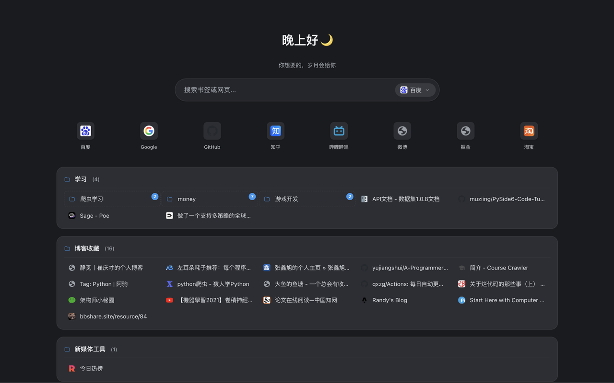
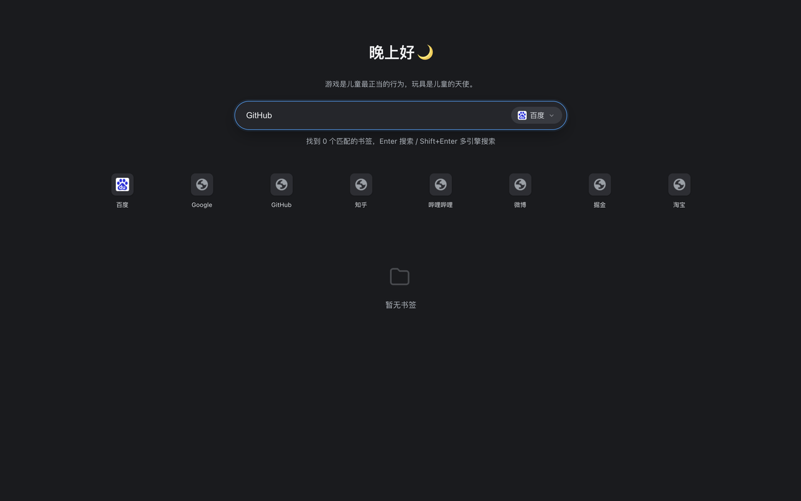
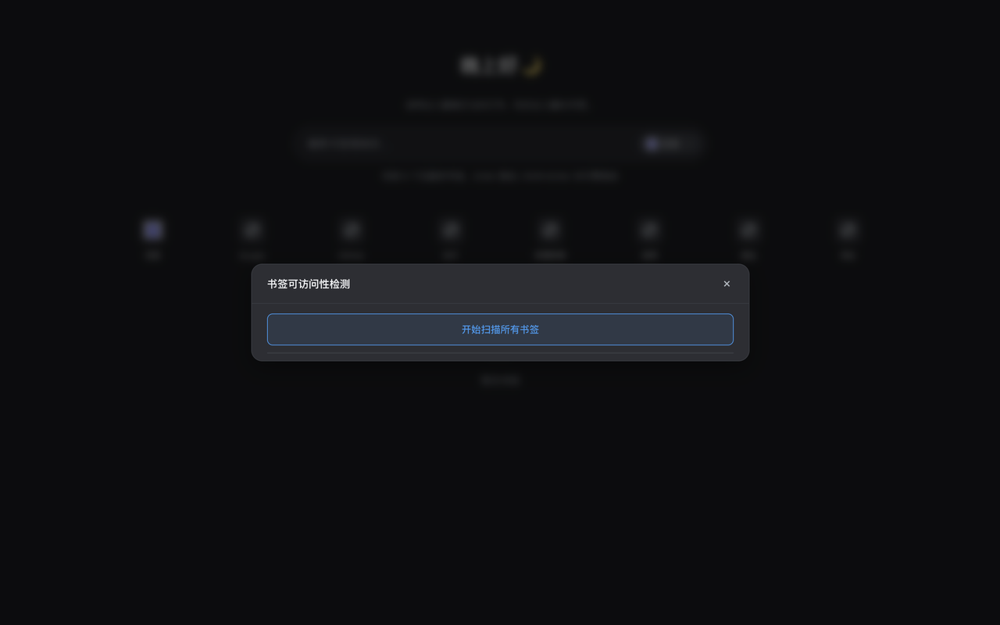
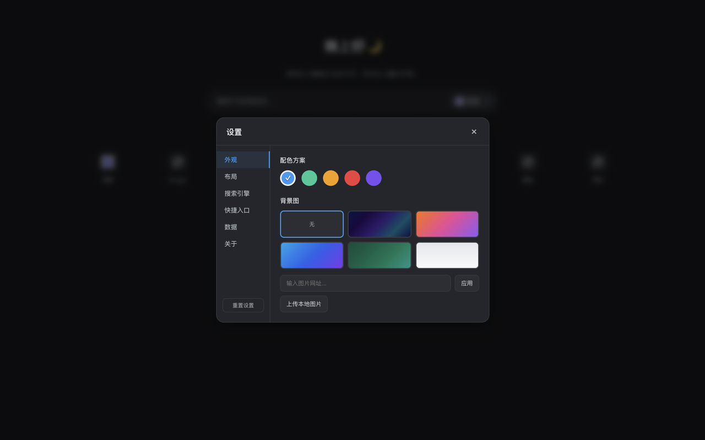
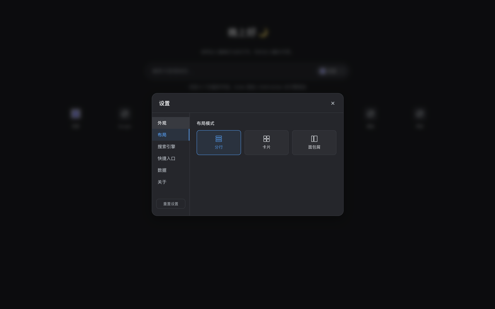
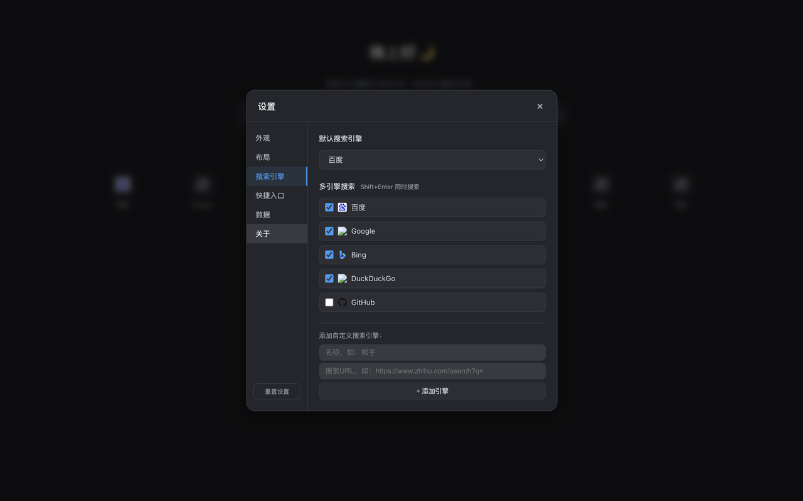
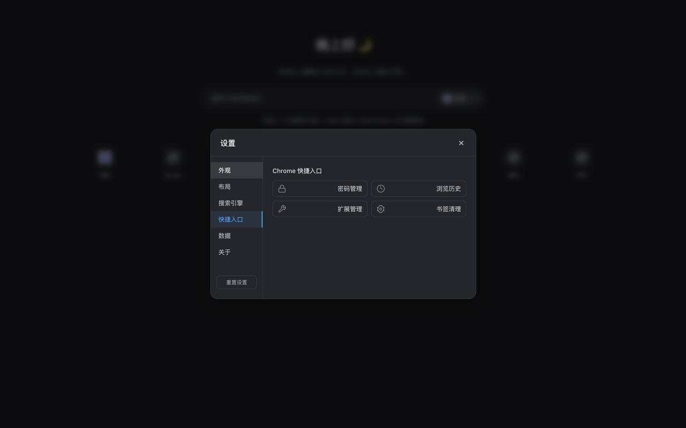
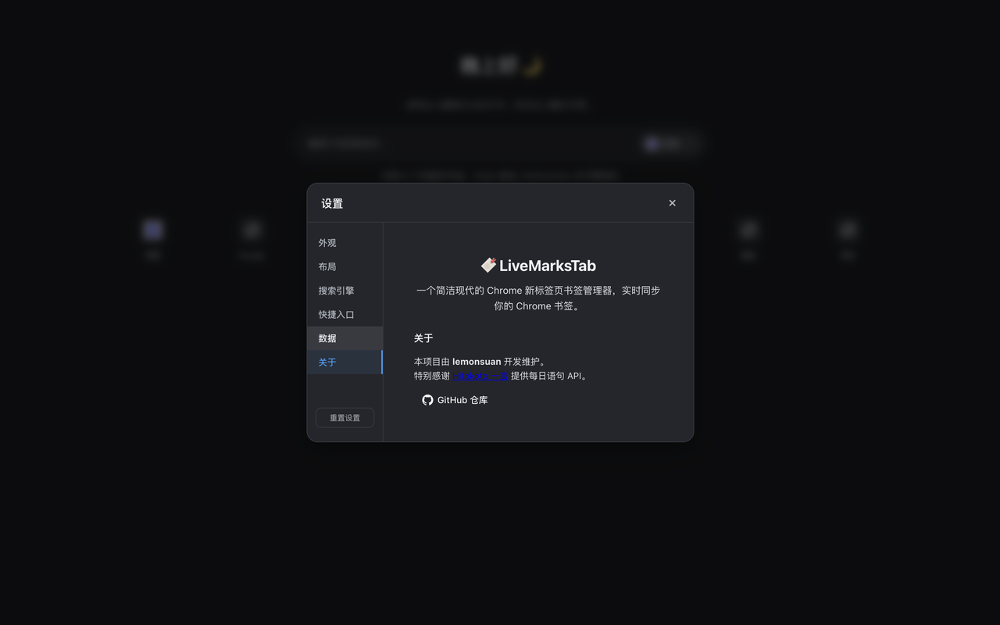
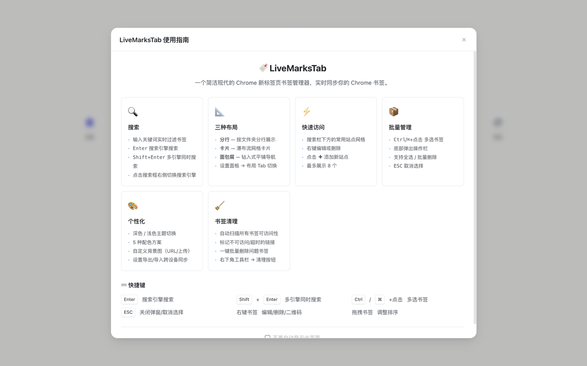

# 📑 LiveMarksTab — Chrome 新标签页书签导航

> 打造极致美观、高效实用的 Chrome 新标签页，将浏览器书签自动渲染为现代化导航界面。


---

## ✨ 核心特性

### 🎨 极致设计

- **现代化界面**：采用毛玻璃特效、平滑动画与精心调配的色彩，提供卓越的视觉体验。
- **深色模式支持**：自动跟随系统或手动切换，保护双眼。
- **自定义背景**：支持网络图片 / 本地上传 / 内置渐变色。

| 浅色模式 | 深色模式 |
| :---: | :---: |
|  |  |

## 📦 安装指南

本项目通过 **Chrome 开发者模式** 安装。

1. **下载代码**
   ```bash
   git clone https://github.com/lemonsuan/LiveMarksTab.git
   ```
   或者下载 ZIP 压缩包并解压。

2. **打开扩展管理页**
   - 在 Chrome 地址栏输入 `chrome://extensions/` 并回车。

3. **开启开发者模式**
   - 打开页面右上角的 **"开发者模式"** 开关。

4. **加载扩展**
   - 点击 **"加载已解压的扩展程序"** 按钮，选择本项目文件夹。

5. **启用**
   - 确保扩展已启用，打开新标签页 (`Cmd/Ctrl + T`) 即可体验。

---

### 🔍 搜索与导航

- **聚合搜索**：集成 Google、Bing、百度、DuckDuckGo、GitHub 等多个搜索引擎。
- **实时过滤**：在搜索框输入关键词，即时筛选显示匹配的书签。
- **快捷键支持**：`Shift+Enter` 可同时在选中的多个搜索引擎中搜索。



### 🚀 高效管理

- **双向实时同步**：书签增删改查实时同步到 Chrome 书签库，反之亦然。
- **拖拽排序**：支持文件夹和书签的自由拖拽排序，所见即所得。
- **右键菜单**：提供打开、编辑、删除、生成二维码等便捷操作。
- **书签清理**：一键扫描失效链接、空文件夹，支持批量清理。



---

## ⚙️ 设置面板

点击右下角 **设置图标 (⚙️)** 打开设置面板，提供丰富的自定义选项：

### 外观

选择配色方案（5 种预设），设置自定义背景图。



### 布局

支持三种布局模式：瀑布流 (Masonry) / 分行 (Grid) / 面包屑 (Breadcrumb)。



### 搜索引擎

管理和自定义搜索引擎，支持添加自定义引擎。



### 快捷入口

设置搜索栏下方的常用站点快捷入口。



### 数据

导出 / 导入设置，支持跨设备同步配置。


### 关于

查看项目信息和开发者信息。



---

## ❓ 使用帮助

首次使用时会自动弹出使用指南，也可以随时点击右下角 **帮助按钮 (❓)** 查看。



---

## ⌨️ 快捷键

| 快捷键 | 功能 |
| :--- | :--- |
| `Enter` | 搜索引擎搜索 |
| `Shift + Enter` | 多引擎同时搜索 |
| `Ctrl/⌘ + 点击` | 多选书签 |
| `ESC` | 关闭弹窗 / 取消选择 |
| 右键书签 | 编辑 / 删除 / 二维码 |
| 拖拽书签 | 调整排序 |

---

## 🛡️ 权限说明

| 权限 | 用途 |
| :--- | :--- |
| `bookmarks` | 读取和修改书签，实现导航页与浏览器数据的同步。 |
| `favicon` | 获取网站图标，美化书签显示。 |
| `storage` | 保存布局偏好、主题设置等本地配置。 |
| `host_permissions` | 书签清理功能中检测链接是否有效。 |

---

## 🏗️ 技术栈

- **核心**：原生 JavaScript (ES6+)，无繁重框架依赖，追求极致性能与秒开速度。
- **样式**：CSS Variables (动态主题) + Flexbox/Grid (响应式布局)。
- **库**：`qrcode-generator` (轻量级二维码生成)。

---

## 🤝 贡献

欢迎提交 Issue 或 Pull Request 来改进本项目！

## 📄 许可证

MIT License
